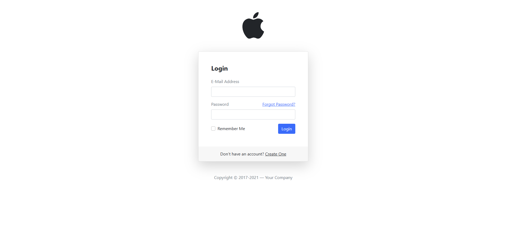
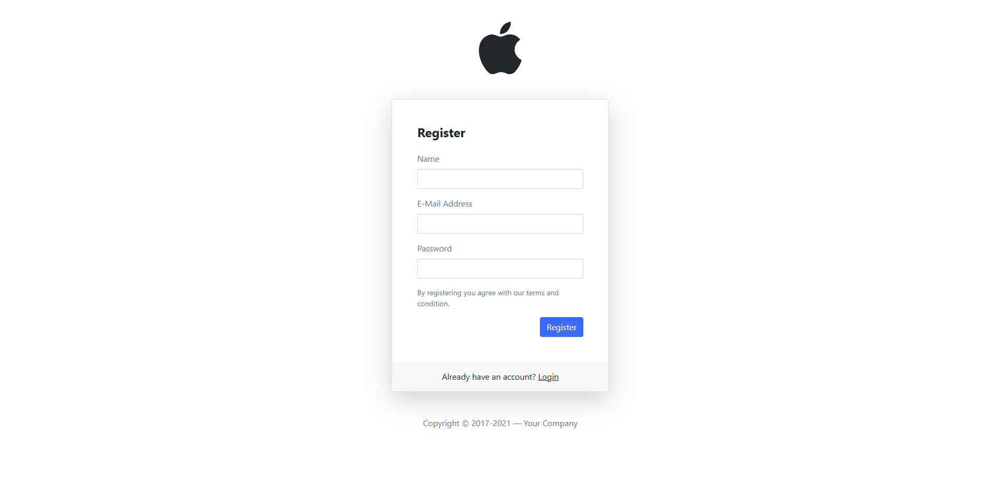
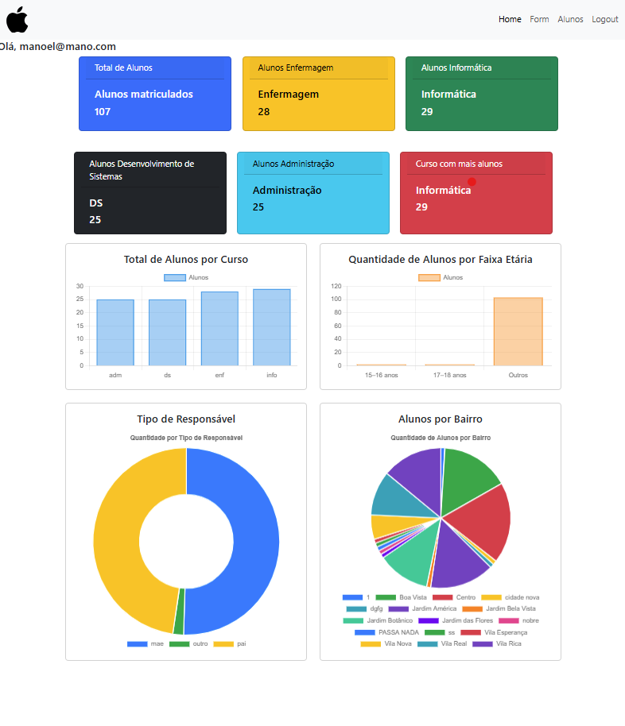
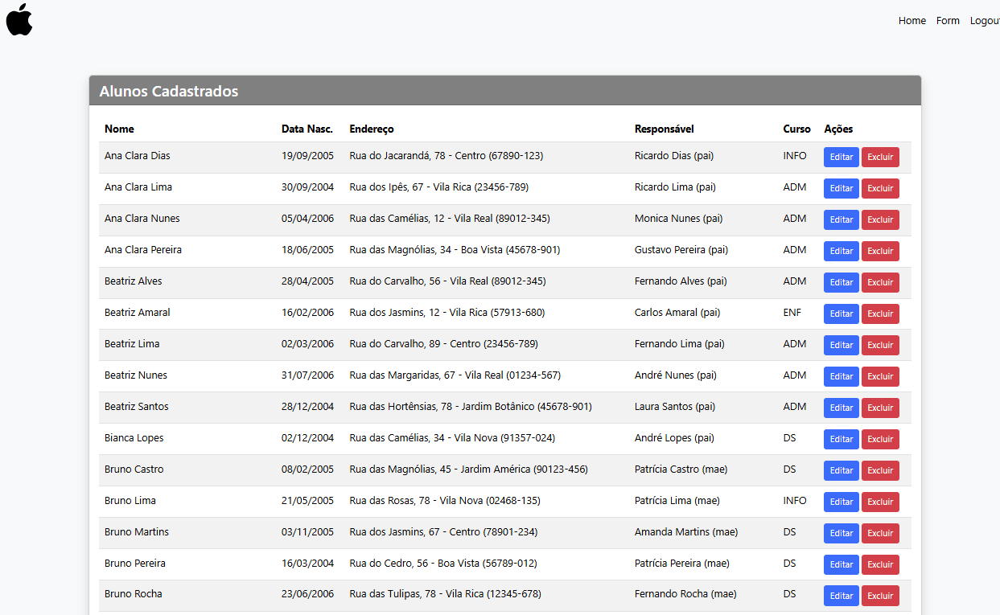
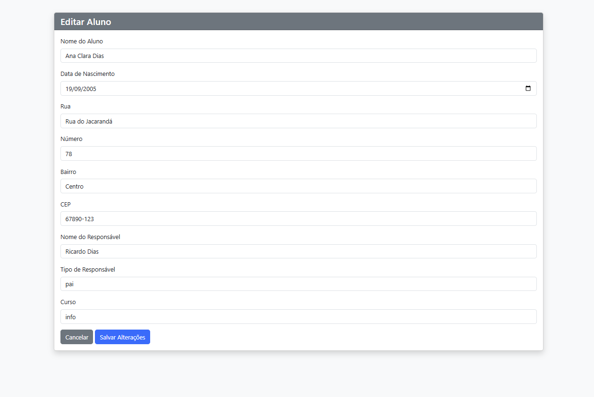

# Sistema-Trabalho-Banco-de-Dados
Aplicação web em PHP integrada ao MySQL, com autenticação via sessões, CRUD completo de alunos e consultas otimizadas. Inclui dashboard dinâmico usando Chart.js para análise por curso, faixa etária, bairro e tipo de responsável. Interface responsiva construída com Bootstrap.


### 📂 Estrutura do Projeto
O projeto está organizado nos seguintes arquivos PHP e SQL:

- ├── cadastrao_aluno.php

- ├── cadastro.php

- ├── conexao.php

- ├── dados.sql

- ├── editar_aluno.php

- ├── excluir_aluno.php

- ├── form.php

- ├── index.php

- ├── listar_alunos.php

- ├── login.php

- ├── logout.php

- ├── navbar.php 

- ├── painel.php

- └── verifica_login.php 

- └── telacadastro.php

- └── verifica_login.php

### 🚀 Funcionalidades

✅ Cadastrar novos usuários

✅ Fazer Login de usuários

🗑️ Remover alunos

📋 Listar todos os alunos em uma tabela

🔐 Proteger Painel

✏️ Editar dados de alunos existentes

⬅️ Fazer Logout da sessão

✅ Cadastrar novos alunos

✅ Dashboard que exibe estatísticas e gráficos de resumo sobre os alunos cadastrados;

✅ Interface para um novo usuário se registrar no sistema;

✅ Atualização dos dados de um aluno específico no banco de dados.

### 🛠️ Tecnologias Utilizadas

PHP: Lógica de backend, manipulação de dados, autenticação e controle de sessão.

MySQL: Armazenamento das informações de usuários (users) e alunos (dados).

Bootstrap 5.x: Estilização, responsividade e componentes de interface.

HTML: Estrutura das páginas web e formulários.

MD5(): Utilizado para criptografar a senha do usuário no momento do cadastro.

session_start(): Utilizado para iniciar e gerenciar sessões de usuário.

🗃️ Banco de Dados

O banco de dados foi criado utilizando o phpMyAdmin, uma ferramenta web para administração do MySQL.
Como criar o banco via phpMyAdmin
Acesse o phpMyAdmin pelo navegador (geralmente em http://localhost/phpmyadmin).

Crie um banco de dados chamado "login".

Selecione o banco criado e vá até a aba SQL.

'
Cole o seguinte código para criar a tabela:
```
CREATE TABLE `dados` (
  `id_aluno` int(11) NOT NULL,
  `aluno_name` varchar(100) NOT NULL,
  `data_nasc` date NOT NULL,
  `rua` varchar(70) NOT NULL,
  `numero` int(11) NOT NULL,
  `bairro` varchar(70) NOT NULL,
  `cep` int(8) NOT NULL,
  `nome_responsavel` varchar(100) NOT NULL,
  `tipo_responsavel` varchar(20) NOT NULL,
  `curso` varchar(50) NOT NULL
) ENGINE=InnoDB DEFAULT CHARSET=utf8mb4 COLLATE=utf8mb4_general_ci;

 
ALTER TABLE `dados`
  ADD PRIMARY KEY (`id_aluno`);

ALTER TABLE `dados`
  MODIFY `id_aluno` int(11) NOT NULL AUTO_INCREMENT, AUTO_INCREMENT=3;
);
```

Execute o comando e verifique se a tabela foi criada corretamente.

📸 Imagens do projeto













